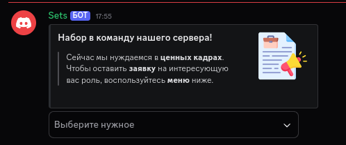

# Система заявок

Этот бот заявок написан на [TypeScript](https://www.typescriptlang.org/) с использованием [Bun](https://bun.sh) в версии 1.2.5. Он предназначен для создания заявок на вашем сервере.

> ## Пример

> ## Запуск

- **Пункт 1**: Подготовка
  - Выполните команду `bun install` в терминале, чтобы установить зависимости.

- **Пункт 2**: Подготовка
  - Заполните конфиг `./src/config.ts`.

- **Пункт 3**: Запуск
  - Запустите проект с помощью команды `bun run src/index.ts`.

> В конце я хотел бы попросить вас поставить ⭐ на этот репозиторий!
